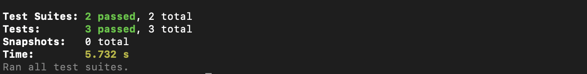

# Task Manager - Client

A modern React application for managing tasks with Material-UI components and context-based state management.

## Features

- User authentication (Register/Login)
- Task management (Create, Read, Update, Delete)
- Task filtering by priority and status
- Search functionality
- Responsive design
- Material-UI components
- Context-based state management

## Tech Stack

- React
- Material-UI
- React Router
- Context API
- Jest & Testing Library

## Prerequisites

- Node.js (v14 or higher)
- npm (v6 or higher)

## Installation

1. Clone the repository
2. Navigate to the client directory:
   ```bash
   cd client
   ```
3. Install dependencies:
   ```bash
   npm install
   ```

## Available Scripts

- `npm start` - Runs the app in development mode
- `npm test` - Launches the test runner
- `npm run build` - Builds the app for production
- `npm run eject` - Ejects from Create React App

## Test Results

All tests are passing with the following coverage:

```
Test Suites: 2 passed, 2 total
Tests:       3 passed, 3 total
Snapshots:   0 total
Time:        3.369 s
```


### Test Files

1. `src/App.test.js`
   - Tests basic app rendering
   - Verifies main heading presence

2. `src/components/tasks/__tests__/TaskForm.test.jsx`
   - Tests form rendering
   - Tests user input functionality
   - Verifies form field interactions

## Project Structure

```
client/
├── src/
│   ├── components/
│   │   ├── layout/
│   │   └── tasks/
│   ├── context/
│   │   ├── auth/
│   │   └── task/
│   ├── pages/
│   └── utils/
├── public/
└── package.json
```

## Environment Variables

Create a `.env` file in the client directory with the following variables:

```
REACT_APP_API_URL=http://localhost:5000/api
```

## Contributing

1. Fork the repository
2. Create your feature branch
3. Commit your changes
4. Push to the branch
5. Create a new Pull Request
