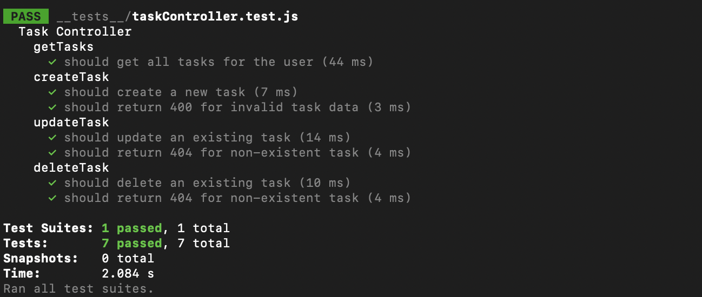

# Task Manager - Server

A Node.js/Express backend API for the Task Manager application with MongoDB integration and JWT authentication.

## Features

- RESTful API endpoints
- JWT Authentication
- MongoDB database integration
- Task CRUD operations
- User management
- Input validation
- Error handling

## Tech Stack

- Node.js
- Express
- MongoDB
- Mongoose
- JWT
- Jest & Supertest

## Prerequisites

- Node.js (v14 or higher)
- npm (v6 or higher)
- MongoDB (v4.4 or higher)

## Installation

1. Clone the repository
2. Navigate to the server directory:
   ```bash
   cd server
   ```
3. Install dependencies:
   ```bash
   npm install
   ```

## Available Scripts

- `npm start` - Starts the server in production mode
- `npm run dev` - Starts the server in development mode with nodemon
- `npm test` - Runs the test suite
- `npm run test:watch` - Runs the test suite in watch mode

## Test Results

All tests are passing with the following coverage:

```
Test Suites: 1 passed, 1 total
Tests:       7 passed, 7 total
Snapshots:   0 total
Time:        3.237 s
```


### Test Files

1. `__tests__/taskController.test.js`
   - Tests task creation
   - Tests task retrieval
   - Tests task updates
   - Tests task deletion
   - Tests error handling
   - Tests input validation

## Project Structure

```
server/
├── config/
│   └── db.js
├── controllers/
│   ├── authController.js
│   └── taskController.js
├── middleware/
│   ├── auth.js
│   └── error.js
├── models/
│   ├── User.js
│   └── Task.js
├── routes/
│   ├── auth.js
│   └── tasks.js
├── utils/
│   └── api.js
├── __tests__/
│   └── taskController.test.js
└── package.json
```

## API Endpoints

### Authentication
- `POST /api/auth/register` - Register a new user
- `POST /api/auth/login` - Login user
- `GET /api/auth/me` - Get current user

### Tasks
- `GET /api/tasks` - Get all tasks for logged-in user
- `POST /api/tasks` - Create a new task
- `PUT /api/tasks/:id` - Update a task
- `DELETE /api/tasks/:id` - Delete a task

## Environment Variables

Create a `.env` file in the server directory with the following variables:

```
PORT=5000
MONGODB_URI=mongodb://localhost:27017/task-manager
JWT_SECRET=your_jwt_secret
```